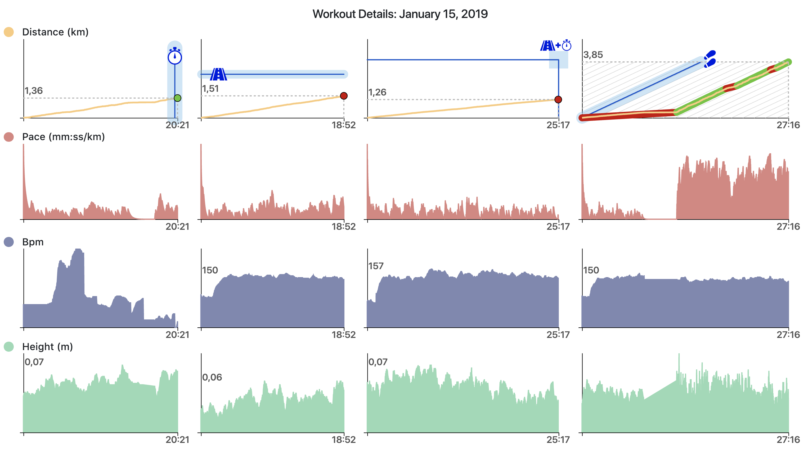
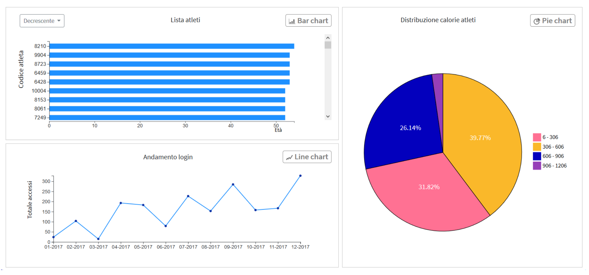

<header>
<h1>AI4FIT </h1>

Artificial Intelligence & Human Computer Interaction for the e-coaching

</header>

The main objective of the project is to increase the current functionality of the [u4fit](https://www.u4fit.com/) platform by inserting artificial intelligence functions, which can be inspected and controlled by the different users of the platform.

The project has been funded by [Sardegna Ricerche](https://www.regione.sardegna.it/) started in 
2017 and it will finish in 2020. 

##Outline
1. [Project Goals](#obiettivi)
2. [Results](#risultati)
3. [The Research Group](#gruppo)
5. [Papers](#pubblicazioni)

## Project Goals
u4Fit is an app for runners of all levels, which tries to respond with technology to the problem of do-it-yourself workouts that result in being ineffective
due to a fluctuating motivation and puts health risks due to incorrect training protocols. u4fit solves these problems by offering the possibility of being supported and supervised
remotely by a real coach, choosing it from many available in a free marketplace. It also provides both (coaches and athletes) with cutting-edge tools to support them in their respective activities: work platform for trainers and training tools for athletes.

During the project, the goal is to add artificial intelligence algorithms to provide coaches and advanced athletes with intelligent tools, which will have an impact on all the processes that concern the trainer-athlete relationship. Specifically, using artificial intelligence for the analysis of fitness data (for example the results of a workout), it will automatically provide the trainer with as much information as possible to allow him to make decisions and give the correct feedback to customers .

## Results

###Data visualization for coaches
We created an interface for the automatic classification algorithms and the advice from a human expert for providing remote feedback to runners. The intelligent support proposes a rating for each registered workout using machine learning techniques, while the interface explicitly represents the classification confidence and the limits for increasing and decreasing the rating for each considered feature. The goal is providing high-quality feedback to a large number of athletes, focusing the coach's attention on those workouts that require the analysis of an expert, supporting both the inspection and the control of the machine proposed classification. We evaluated the interface with real coaches showing a good acceptance of the visualization. .

*Figura 1: Visualization of a sample workout consisting of four segments with different goals (time, distance, time and distance, pace). It contains four different time-aligned graphs on the x axis, one for each tracked metric: distance, pace, heartbeats per minute and altitude (height). White spaces on the x axis correspond to rest times between two workouts segments.*

### Inspecting data using natural language
We created a simple architecture for supporting the inspection of a generic dataset using natural language queries. We show how to integrate modern Articial Intelligence libraries in the system and how to derive chart visualization out of the user's intent. Finally, we report on the user evaluation of the interface, showing a good acceptance and theectiveness of the proposed approach.

*Figura 2: Result of the query "Show me the duration of the workouts by athletes between 20 and 55 years old, grouped by calories and with their login trend by  month*

## Research Group
* **Lucio Davide Spano.** Principal Investigator.
* **Federico Maria Cau.** Research Fellow.
* **Mattia Samuel Mancosu.** Research Fellow.
* **Alessandro Carcangiu.** Research Fellow.

## Project Publications
* Francesca Bacci, Federico Maria Cau, Lucio Davide Spano: Inspecting Data Using Natural Language Queries. Proceedings of ICCSA 2020. 
* Federico Maria Cau, Mattia Samuel Mancosu, Fabrizio Mulas, Paolo Pilloni, Lucio Davide Spano: An intelligent interface for supporting coaches in providing running feedback. CHItaly 2019: 6:1-6:5
* Federico Maria Cau, Mattia Samuel Mancosu, Fabrizio Mulas, Paolo Pilloni, Lucio Davide Spano: An interface for explaining the automatic classification of runners' trainings. IUI Companion 2019: 41-42

