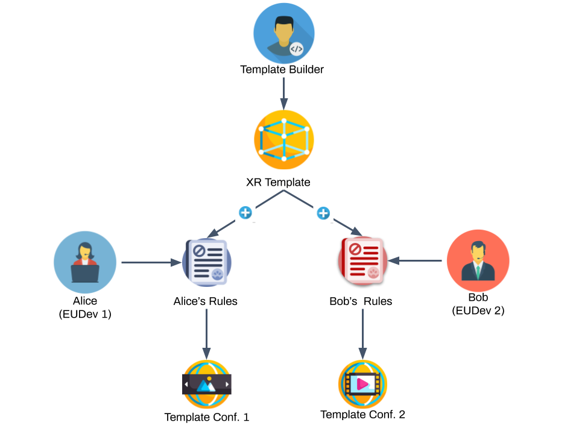

<header>
<h1> </h1>

Event-Condition-Action Rules for all

</header>

The ECARules4All project aims at developing a Unity plugin for enabling end-users without programming
experience to modify the behaviour of an XR experience through event-condition action
rules, defined in natural language. The solution consists of four parts: 1) the high-level types that end-user developers (EUDevs) exploit for customizing the XR experience; 2) the specification of the Event-Condition-Action rule language; 3) the specification of the Rule Language API for developing templates configurable through the proposed rule language; 4) the immersive interface for supporting end-users in defining the rules; and 5) the definition of the case studies.

This project has received funding from the European Union’s Horizon 2020 research and innovation programme through the [XR4All H2020 project](https://xr4all.eu) project with grant agreement No 825545.
It started in October 2020 and ended in June 2021.

The project results are available in the [XR4All solution catalogue](https://dev.xr4all.eu/product/ecarules4all-vr-for-everyone/)

## Outline
1. [Demonstration Video](#video)
2. [Project Description](#obiettivi)
3. [The Research Group](#gruppo)

##Demonstration Video

<iframe width="420" height="315" src="https://www.youtube.com/embed/lQBSsNolP3w"></iframe>

One of the most challenging challenges for opening XR experiences for all is supporting the creation and editing for end-users, even though using limited and simplified approaches. Currently, building XR experiences requires different skills and, usually, it involves a team including 3D modelling experts, developers, game designers etc. While shifting the entire building process towards end-users is not entirely feasible, it is possible to configure the environments through scene builders or inspectors, which allow placing and orienting 3D models that constitute the virtual word in both immersive or desktop mode. So it is relatively easy for end-users to get objects from a model repository and to create a static virtual world.  What is currently difficult for them is the definition of the object behaviour, i.e., responding to the interaction with the user or with other objects. We propose an End-User Development (EUD) technique for solving this problem, which consists of defining the object behaviour through  Event-Condition-Action rules expressed in natural language. The approach already demonstrated its effectiveness in different fields, for instance for IoT.

The main goal of ECARules4ALL is the definition of a Unity plugin for enabling end-users without programming experience to modify the behaviour of an XR experience through Event-Condition Action rules (ECA), defined in natural language.  The rules will define the behaviour of each virtual object in the environment in isolation and its interaction with other objects. Once equipped with components supporting the runtime specification of behaviour rules, the XR environments will offer a high degree of customization to end-users. We foresee the opportunity for them to pick existing environments and tailor them for their purposes, as currently happens with website templates.

*The workflow proposed in the ECARules4All project. Experts (Template Builders) design template XR environments, instrumented through the library we propose. People without technical skills take advantage of the instrumentation for defining their own configuration of the templates, defining the environment behaviour through rules in natural language.*

In summary, [Figure 1](#figura1) shows the workflow we envision in this project. We have three different types of users in the proposed solution:
 *  **Template Builders (TB)**, which represent users with good skills in both 3D modelling and game programming. We assume that they are proficient with Unity 3D, and they can build complex XR environments. 
* **End User Developers (EUDev)**, which represent users without skills in 3D modelling and game programming, but having an average familiarity with computer use (e.g., proficient in using standard office programs) and with XR environments (e.g., they played 3D videogames or have VR/AR experience as users). They represent people that may require creating XR contents for their business or leisure (e.g., for touristic promotion, content advertisement etc.) but they cannot build an entire environment on their own.  Besides, they are supposed to have a limited budget for creating the content or, even if they have the budget, they need to modify the content by themselves (e.g., they update the XR content frequently). 
  * **Users**, which represent the final consumer of the XR contents, either created by professionals or by EUDevs.

The current workflow for building XR environments involves only technical expert people (identified as TB in this project), which create the environments and distribute them through different channels (e.g., web, subscription services). These XR environments are somehow closed to changes: for modifying their behaviour, we usually need a develop-build-distribution cycle.

We propose to change such paradigm allowing EUDevs to modify the behaviour of XR environment themselves. They will start from pre-defined XR environments, which they will configure and adapt to their needs. In the proposed workflow, the environment prepared by experts represents a solution adaptable to different settings by configuring its behaviour and adding content in pre-defined points. They will not resemble a complete, final version of an interactive XR environment, but rather a _template_, which EUDevs can tailor to their needs. For instance, a TB can create a template for a virtual shop, and different EUDevs can adapt it to their shop, e.g., one selling shoes and one selling t-shirts. Alternatively, a template can represent a virtual museum, where different managers can put 3D scans of the artwork in their real museum.

For creating a usable configuration mechanism, EUDevs need a language for specifying the XR environment behaviour they can understand and manipulate. This point is the core of the ECARules4All project. We  define the following building blocks for supporting them:

* A compact, simplified yet complete taxonomy of the objects that one can manipulate inside an XR environment. For each object category, we define a set of high-level actions they support.
* A way for specifying the interaction among these objects, resulting in the definition of the XR environment behaviour. We propose to support it through rules, readable and understandable as natural language sentences.
* A user interface for entering the rules while immersed in the environment.

##ResearchGroup
* **Lucio Davide Spano** Principal Investigator
* **Ivan Blecic** Project idea co-author

###Project Development Team
* **Valentino Artizzu**
* **Gianmarco Cherchi**
* **Davide Fara**  
* **Vittoria Frau**
* **Riccardo Macis**
* **Luca Pitzalis**
* **Alessandro Tola** 

