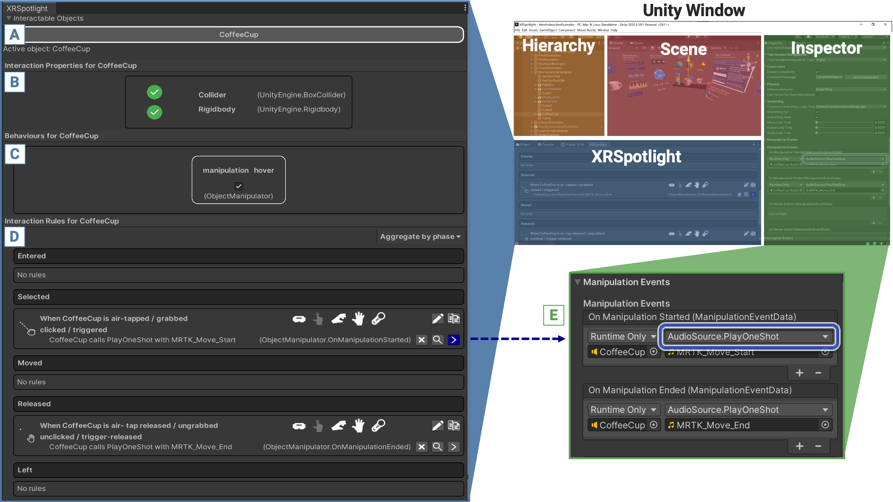

<header>
    <h1>XRSpotlight</h1>
</header>

XRSpotlight is a Unity editor that enables users novice developers by curating a list of the XR interactions defined in a Unity scene and presenting them as rules in natural language. The support provided by XRSpotlight consists of three main features: (1) expressing interactions in natural language, (2) finding examples of similar interactions in the scene, and (3) copy-pasting interactions in a toolkit-agnostic way.

The project code is available in the [Github](https://github.com/cg3hci/XRSpotlight/tree/main)

## Outline
1. [Walkthrough Video](#video)
2. [Project Description](#obiettivi)
3. [The Research Group](#gruppo)

##Demonstration Video

### Walkthrough Video

<iframe width="560" height="315" src="https://www.youtube.com/embed/cVCGNaHMb_Y" title="YouTube video player" frameborder="0" allow="accelerometer; autoplay; clipboard-write; encrypted-media; gyroscope; picture-in-picture; web-share" allowfullscreen></iframe>

##Project Description

Research on enabling novice AR/VR developers has emphasized the need to lower the technical barriers to entry. This is often achieved by providing new authoring tools that provide simpler means to implement XR interactions through abstraction. However, novices are then bound by the ceiling of each tool and may not form the correct mental model of how interactions are implemented. We present XRSpotlight, a system that supports novices by curating a list of the XR interactions defined in a Unity scene and presenting them as rules in natural language. Our approach is based on a model abstraction that unifies existing XR toolkit implementations. 
Using our model, XRSpotlight can find incomplete specifications of interactions, suggest similar interactions, and copy-paste interactions from examples using different toolkits. 

*The XRSpotlight panel in the Unity editor. A: foldout menu showing all the interactable objects in the scene (partially cut for readability). B: information about the support to collision detection and physics. C: interactive behaviours provided by the components associated with the XR object. D: interaction rules, aggregated by phase (see Section 6.1). Each rule entry has icons representing the modalities it supports and a set of buttons allowing (starting from the upper left): to change the trigger, copy the rule, delete the action, find similar actions and show the definition on the Inspector. E: Highlighting the definition of a rule action (consequence) in the Unity Inspector.*

##ResearchGroup
* **Lucio Davide Spano** Mentor
* **Michael Nebeling** Mentor

###Project Development Team
* **Vittoria Frau**
* **Valentino Artizzu**

